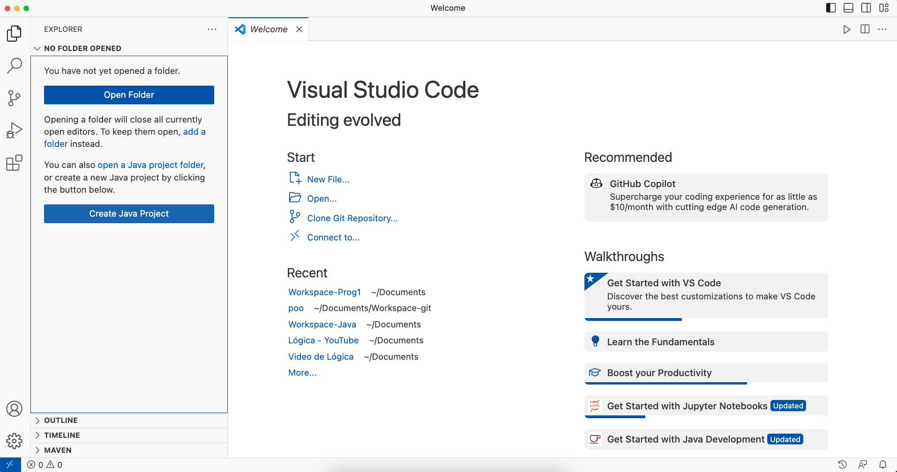

<h1 style="color: gray">Programación Orientada a Objetos</h1>

<h5 style="color: gray">Área de programación 
Programa de Ingeniería de Sistemas y Computación 
Facultad de Ingeniería
</h5>

<b>
<h2>Creando un nuevo proyecto</h2>
</b>

---

<!--  -->

---

<!--  -->

---

<!--  -->

---

<!--  -->

---

<!--  -->

---

<!--  -->

---

<!--  -->

---

<!--  -->

---

<!--  -->

---

<!--  -->

---

<!--  -->

---

<!--  -->

---

<!--  -->

---

<!--  -->

---

<!--  -->

---

<!--  -->

---

<!--  -->

---

<!--  -->

---

<!--  -->

---

<!--  -->

---

<!--  -->

---

<!--  -->

---

# Actualizando el archivo de configuración **pom.xml**

- Número de la versión a de Java que se utilizará, para nuestro caso, 17.

- Cambiar la versión del componente de pruebas a **JUnit Jupiter**.

  - Actualizar el ejemplo de la prueba a la nueva versión

- (opcionalmente) eliminar los *plugins* que no usaremos, dejando solamente:
  - *maven-compiler-plugin* (utilizado para compilar el proyecto) v. 3.11.0
  - *maven-surefire-plugin* (utilizado para ejecutar las pruebas) v. 3.1.2

---

<!--  -->

---

<!--  -->

---

<!--  -->

---

<!--  -->

---

<!--  -->

---

<!--  -->

---

<!--  -->

---

<!--  -->

---

<!--  -->

---

<!--  -->

---

<!--  -->

---

<!--  -->

---

<!-- 
_header: ''
_footer: '' 
_paginate: false
_backgroundImage: url('imagenes/gracias.png')
-->
